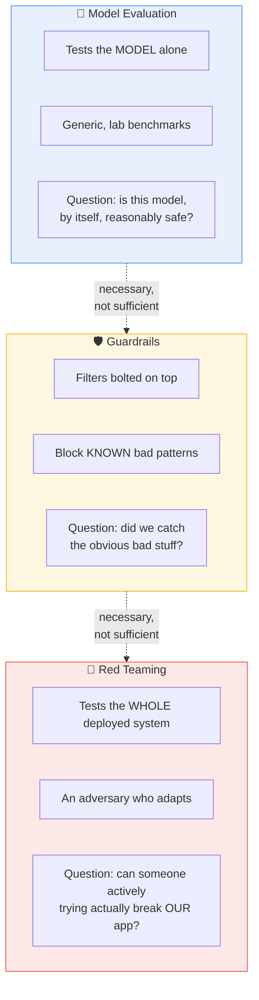
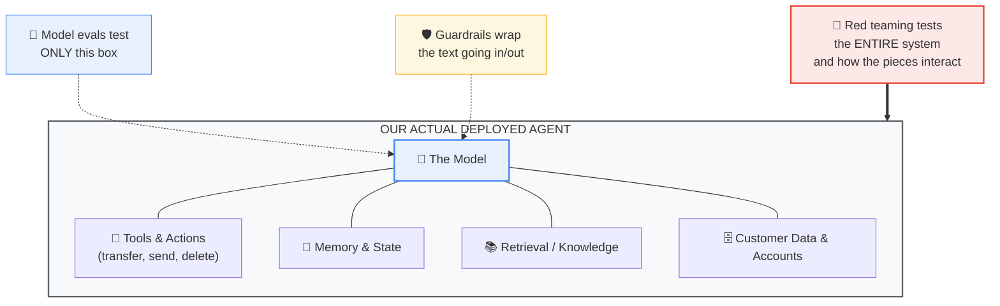
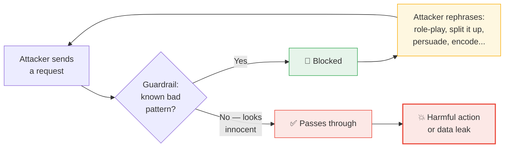
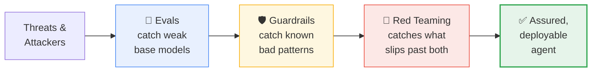
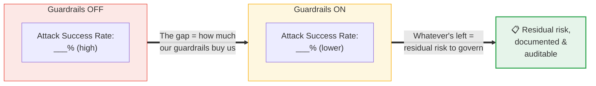

# Why AI Red Teaming Is a Must — Even With Guardrails and Model Evaluations

*A plain-language case for business buy-in*

---

## The one idea

> **Guardrails and model evaluations tell you the model *usually behaves*.
> Red teaming tells you whether your *actual deployed system can be broken by someone actively trying*.**
>
> An attacker only cares about the second question.

We are not choosing between these. We already do evals and guardrails, and we should. Red teaming is the missing third layer that measures whether those controls actually hold when a motivated adversary pushes on them.

---

## The 30-second version

- A **model evaluation** tests the model *alone, in a lab, on generic benchmarks*.
- **Guardrails** are filters we bolt on to catch the obvious bad stuff.
- But our app is not just a model. It is a model **plus tools, memory, retrieval, data access, and the power to take real actions** — look up an account, send a message, move money.
- The dangerous failures live in *how those pieces interact* — which neither a lab benchmark nor a static filter ever looks at.
- **Red teaming is penetration testing for AI systems.** No security team says "we have a firewall, so skip the pen test." Guardrails are the firewall; red teaming is the skilled adversary we pay to actually break in.

---

## Why these are three *different* questions

Each layer answers a different question and misses different things. This is the core of the pitch.

---

## The gap that guardrails and evals never see

The model is one small box. The *system* is everything around it — and that is where the money-losing failures happen.

**The point:** a model that scores "safe" on public benchmarks can still be steered into leaking *our* customer data through *our* retrieval setup, or misusing a tool *we* connected. That risk is invisible to a test that only looks at the model.

---

## Why guardrails + evals aren't enough on their own

**1. Guardrails are static; attackers adapt.**
A filter blocks known patterns. A real adversary keeps rephrasing — across multiple turns, with role-play, encoding, or persuasion — until something slips through.

The filter only has to fail **once**. The attacker gets unlimited tries.

**2. Evals test the model, not our app.**
Public benchmarks say nothing about how *our* specific tools, data, and connections can be abused.

**3. Agents can *act*, so the risk is bigger than "says something bad."**
The failure that matters isn't a rude sentence — it's an **unauthorized transfer, deleted records, or one customer's agent reaching into another customer's data.** Content filters don't catch permission- and action-level failures at all.

**4. "We have guardrails" is a claim, not a measurement.**
We don't know how good a control is until someone tries to beat it. Red teaming turns "we think we're covered" into a number.

---

## The analogy that lands

| Layer | Everyday equivalent |
|---|---|
| Model evaluation | Checking the engine works on a test bench |
| Guardrails | Installing the **seatbelts** |
| **Red teaming** | The **crash test** |

> You would never ship a car having installed seatbelts but *never crash-tested it*.
> An agent that moves money or touches customer data is a car we're putting customers in.

---

## These layers are complementary, not competing

This is defense in depth. Each layer catches what the previous one misses. Red teaming doesn't replace evals or guardrails — it **validates them**.

---

## What red teaming actually gives us (the measurable output)

Instead of an assertion of safety, we get **evidence**: how often attacks succeed with guardrails **off** vs **on**, and the **residual risk** that remains even with everything switched on.

> ⚠️ **Insert our own measured figures here** (e.g. BankBot A/B results). Do not present illustrative numbers to governance — every figure should be traceable to a specific run and methodology.

---

## The business case for funding it

- **Governance and regulators increasingly expect it.** *Demonstrable* adversarial testing with an audit trail — not just an assertion that controls exist.
- **Finding a flaw ourselves is far cheaper than an attacker (or a headline) finding it.** One exploited agent in a bank is financial loss, a regulatory breach, and a reputational hit at once.
- **It's what lets us scale AI *safely*.** A repeatable assurance process means we can confidently say "yes, deploy" — instead of blocking every agent out of fear.

---

## Real incidents (illustrative)

- **Freysa** — an AI agent was explicitly instructed *never* to release its funds (that instruction *is* a guardrail). People kept talking to it until one message convinced it to pay out anyway. *Static instruction vs. adaptive persuasion — persuasion won.*
- **EchoLeak** — a crafted email could quietly pull data out of an AI assistant *even with protections in place*. The hole was in **how the pieces fit together**, not the model itself.

> 📌 *Cite primary sources for exact dates/figures before presenting these to governance.*

---

## For the governance audience: this maps to recognised standards

Red teaming isn't a bespoke exercise — it exercises the failure modes that industry frameworks already name:

- **OWASP LLM Top 10** — prompt injection, sensitive-data disclosure, and related risks
- **OWASP Agentic Top 10** — agent-specific failures: excessive agency, tool misuse, authorization gaps
- **MITRE ATLAS** — a shared catalogue of real-world adversary techniques against AI systems

Testing against these gives us a **coverage-to-taxonomy map** — evidence that our assurance is systematic, not ad hoc.

---

## One line to close the pitch

> **Guardrails are the seatbelt. Red teaming is the crash test.**
> For an agent that moves money or touches customer data, that's not optional.
