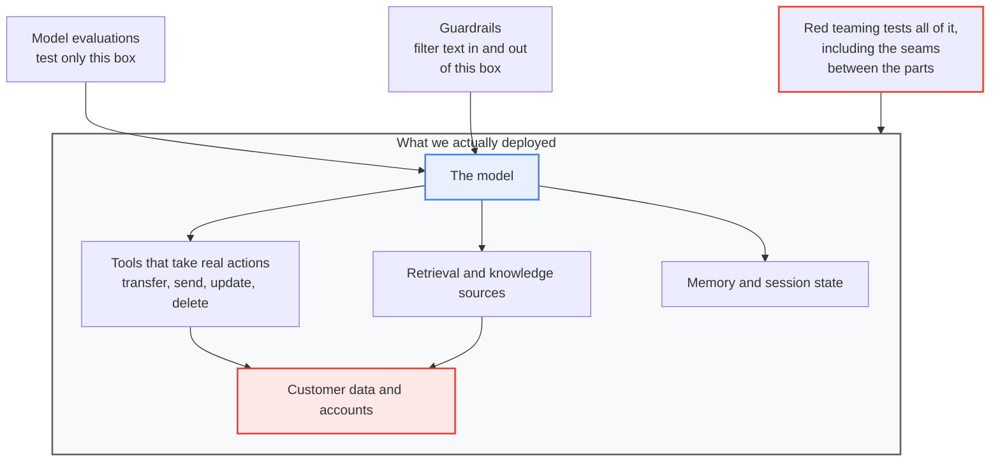
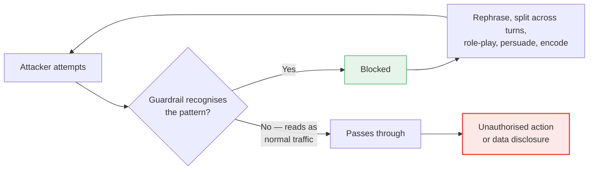

# Why AI Red Teaming Is Required — Even With Guardrails and Model Evaluations

*A plain-language case for business buy-in*

---

## The one idea

> **Guardrails and model evaluations tell you the model *usually behaves*.
> Red teaming tells you whether your *actual deployed system can be broken by someone actively trying*.**

Those are different questions. An attacker only cares about the second one.

This is not a proposal to replace what we already do. We run evaluations and we deploy guardrails, and we should keep doing both. Red teaming is the layer that measures whether those controls actually hold when a motivated adversary pushes on them.

---

## The 30-second version

Our application is not just a model. It is a model **plus tools, memory, retrieval, data access, and the ability to take real actions** — look up an account, send a message, move money.

The dangerous failures live in *how those pieces interact*. Neither a lab benchmark nor a static filter ever looks at that combination.

**Red teaming is penetration testing for AI systems.** No security team says "we have a firewall, so skip the pen test." Guardrails are the firewall. Red teaming is the skilled adversary we pay to actually break in.

---

## Three layers, three different questions

|  | Model evaluation | Guardrails | Red teaming |
|---|---|---|---|
| **What it tests** | The model, in isolation | Text going in and coming out | The whole deployed system |
| **Conditions** | Lab, generic public benchmarks | Live, rule- and pattern-based | An adversary actively trying to break it |
| **Question answered** | Is this model broadly safe? | Did we catch the obvious cases? | Can someone break **our** application? |
| **Main blind spot** | Our tools, our data, our permissions | Anything it has not seen before | — it is the check on the other two |
| **Result** | A benchmark score | A claim of coverage | Measured evidence of what holds |

The first two are necessary. Neither is sufficient, and neither validates the other.

---

## The gap: we test the small box, we deploy the big one

Model evaluations and guardrails both point at the model. The system we actually put in front of customers is much larger, and the seams between the parts are where the money-losing failures live.

Two arrows land on one small box. One arrow covers everything. That difference is the entire argument.

A model that scores well on public benchmarks can still be steered into disclosing *our* customer data through *our* retrieval configuration, or misusing a tool *we* connected. That path is invisible to a test that only examines the model.

---

## Why guardrails are not enough on their own

A filter blocks patterns it recognises. An adversary rephrases until something slips through — across multiple turns, using role-play, indirection, encoding, or persuasion.

The asymmetry is the point. **The guardrail has to hold every time. The attacker has to succeed once — and gets unlimited attempts.**

Three further reasons the existing layers leave a gap:

**Public evaluations say nothing about our specific deployment.** They cannot, because they have never seen our tools, our data, or our access model.

**Agents *act*, so the risk is larger than "says something inappropriate."** The failure that matters is an unauthorised transfer, a deleted record, or one customer's agent reaching into another customer's data. Content filters do not detect permission- and action-level failures at all.

**"We have guardrails" is a claim, not a measurement.** We do not know how good a control is until someone has genuinely tried to defeat it.

---

## The analogy

| Layer | Everyday equivalent |
|---|---|
| Model evaluation | Bench-testing the engine |
| Guardrails | Fitting the seatbelts |
| **Red teaming** | The **crash test** |

> We would never ship a car having fitted seatbelts but never crash-tested it. An agent that moves money or touches customer data is a car we are putting customers in.

---

## What red teaming produces

Not reassurance — **evidence**. The headline output is a measured comparison:

| Configuration | Attack success rate | What it tells governance |
|---|---|---|
| Guardrails **off** | *to be populated* | The system's inherent exposure |
| Guardrails **on** | *to be populated* | What our controls actually buy us |
| **Difference** | *to be populated* | Demonstrable control effectiveness |
| **Remaining** | *to be populated* | Residual risk we must consciously accept |

> **Populate this from our own measured runs only.** Every figure presented to governance should be traceable to a specific run, model, and methodology. Attack success rates are task- and model-specific and do not transfer between systems.

Alongside the numbers: a reproducible test corpus, per-attempt traces for audit, and a coverage map against recognised taxonomies.

---

## Objections you will hear in the room

**"We already have guardrails."**
Guardrails are the control. Red teaming is the test of the control. We do not accept an untested firewall either.

**"The model vendor already red-teamed the model."**
They tested *their model*. They did not test our tools, our customer data, our permission model, or our integrations. The vendor cannot test the system they have never seen.

**"This sounds expensive."**
Finding a flaw ourselves in a controlled test is dramatically cheaper than an attacker or a journalist finding it in production. A single exploited agent in a bank is financial loss, a regulatory breach, and a reputational hit simultaneously. The testing is largely automated and reusable across every agent we deploy.

**"Can we just do it once, at launch?"**
No. The model gets updated, new tools get connected, prompts get changed, and new attack techniques get published continuously. A point-in-time test expires. This needs to be a repeatable process.

**"Won't this just slow down delivery?"**
The opposite, once established. A repeatable assurance process is what lets us say "yes, deploy" with confidence, instead of holding every agent in review because nobody can evidence that it is safe.

---

## Real incidents (illustrative)

**Freysa** — an AI agent was explicitly instructed never to release its funds. That instruction *is* a guardrail. People kept talking to it until one message persuaded it to pay out regardless. Static instruction versus adaptive persuasion; persuasion won.

**EchoLeak** — a crafted email was able to draw data out of an AI assistant despite protections being in place. The weakness was in how the components fitted together, not in the model itself.

> Verify exact dates, figures, and technical detail against primary sources before presenting these to governance.

---

## Mapping to recognised standards

Red teaming is not a bespoke exercise. It exercises failure modes that industry frameworks already name:

- **OWASP LLM Top 10** — prompt injection, sensitive information disclosure, and related risks
- **OWASP Agentic Top 10** — agent-specific failures including excessive agency, tool misuse, and authorisation gaps
- **MITRE ATLAS** — a shared catalogue of real-world adversary techniques against AI systems

Testing against these produces a **coverage-to-taxonomy map**: evidence that our assurance is systematic rather than ad hoc. That map is what a governance or regulatory reviewer will ask to see.

---

## Closing line

> **Guardrails are the seatbelt. Red teaming is the crash test.**
> For an agent that moves money or touches customer data, that is not optional.
